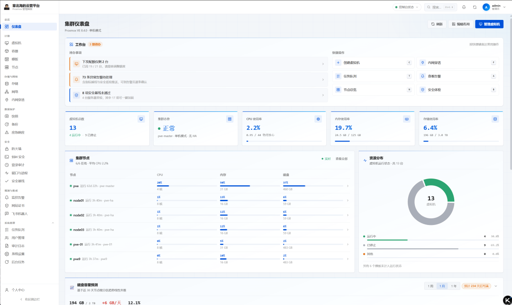

# ProxCenter — Proxmox VE 8.x / 9.x 管理面板

**简体中文 | [English](README.en.md)**

[](LICENSE)
[](../../releases)
[](https://github.com/yjscloud/ProxCenter/actions/workflows/ci.yml)
[](../../commits/main)
[](../../stargazers)


对接 Proxmox VE 8.x / 9.x 的自托管 Web 管理面板。虚拟机和 LXC 容器的全生命周期管理、
cloud-init 模板流水线、网络与防火墙、监控大盘、快照备份、浏览器里直接开 VNC 控制台，
再加上多用户权限、操作审计，以及几项安全运维能力（SSH 防爆破、端口异常检测、基线加固）。

宿主上装了 Docker 就能跑：

```bash
curl -fsSLO https://raw.githubusercontent.com/yjscloud/ProxCenter/main/docker-compose.yml
docker compose up -d
```

打开 `http://你的服务器IP:8080`，账号 `admin`，口令 `ProxCenter@2026`
（怎么改见 [Docker 部署](#docker-部署推荐)）。不想用容器，也可以 `sudo ./deploy.sh`
装成系统服务，见 [裸机部署](#裸机部署)。

> 关键词：Proxmox VE 管理面板 · PVE 面板 · LXC 容器管理 · cloud-init 模板 ·
> 自托管虚拟化平台 · Proxmox alternative UI

**技术栈**：Python 3.11+ / FastAPI / httpx · React 18 + TypeScript + Vite · MySQL 8

在线演示：<https://prox.yjscloud.com>



## 目录

- [一、部署](#一部署)：[准备 Token](#准备-proxmox-api-token) · [授权](#授权) ·
  [Docker 部署](#docker-部署推荐) · [裸机部署](#裸机部署) · [上 HTTPS](#上-https) ·
  [服务管理](#服务管理)
- [二、功能](#二功能) · [三、配置项](#三配置项) · [四、项目结构](#四项目结构) ·
  [五、测试](#五测试) · [六、排查问题](#六排查问题) · [七、安全说明](#七安全说明) ·
  [八、规划](#八规划)

---

## 一、部署

### 准备 Proxmox API Token

面板用 API Token 跟 Proxmox 通信。在 PVE 上执行：

```bash
pveum user add panel@pve --comment "ProxCenter panel"
pveum user token add panel@pve panel --privsep 0
```

输出里 `full-tokenid`（形如 `panel@pve!panel`）填面板的 **Token ID**，`value` 填
**Token Secret**。

### 授权

```bash
pveum acl modify / --user panel@pve --roles PVEVMAdmin,PVEDatastoreUser,PVESDNUser
```

想按最小权限给，就按需要拆开：

| 功能 | 角色 |
|---|---|
| 只看监控 | `PVEAuditor` |
| 开关机、控制台 | `PVEVMUser` |
| 创建 / 删除 / 改配置 / 快照 | `PVEVMAdmin` |
| 备份、ISO 与模板存储 | `PVEDatastoreUser`（要写用 `PVEDatastoreAdmin`） |
| 网桥 / VLAN | `PVESDNUser` |

> 想在浏览器里用控制台，还得在面板设置里另填一个 PVE 账号密码。Proxmox 不允许 API Token
> 访问 `vncproxy`，只认用户密码换来的 ticket。不填只是控制台用不了，其他功能都正常。

### Docker 部署（推荐）

宿主上只要装了 Docker，不用装 Node、Python 或 MySQL：

```bash
curl -fsSLO https://raw.githubusercontent.com/yjscloud/ProxCenter/main/docker-compose.yml
docker compose up -d
```

打开 `http://你的服务器IP:8080`，账号 `admin`，口令 `ProxCenter@2026`。

> **拉镜像报 `denied`？** GHCR 的包默认是**私有**的，任何人都拉不到。维护者首次发布后要到
> <https://github.com/users/yjscloud/packages/container/proxcenter/settings>
> 把可见性改成 **Public**（一次性，之后所有版本都公开）。不想用 GHCR 就换 Docker Hub ——
> 那边的镜像默认公开：`PROXCENTER_IMAGE=docker.io/yjscloud/proxcenter:latest docker compose up -d`。

**改口令。** 三个口令都在 `docker-compose.yml` 里，搜 `★ 改这里` 就能找到。口令行长这样：

```yaml
ADMIN_PASSWORD: ${ADMIN_PASSWORD:-ProxCenter@2026}
```

`:-` 是 compose 的「取默认值」记号，意思是「`.env` 或环境变量里给了就用那个，没给才用
后面这段」。`-`、`$`、`{`、`}` 都只是语法，**真正的口令是 `ProxCenter@2026` 这一段**，
改的时候只动这一段：

```yaml
ADMIN_PASSWORD: ${ADMIN_PASSWORD:-MyPassw0rd2026}
```

要改的是 `ADMIN_PASSWORD`（面板登录）、`DB_PASSWORD`（连数据库）、
`MYSQL_ROOT_PASSWORD`（MySQL 管理员）三处。改完 `docker compose up -d` 重起一遍。

嫌 `${...}` 麻烦，也可以不碰这个文件，在同一个目录建个 `.env` 覆盖，等号后直接写口令：

```
ADMIN_PASSWORD=MyPassw0rd2026
DB_PASSWORD=MyPassw0rd2026-db
MYSQL_ROOT_PASSWORD=MyPassw0rd2026-root
```

优先级是环境变量 / `.env` 高于 `docker-compose.yml` 里的默认值。

有两个坑先说清楚：

- **口令只在第一次初始化时生效。** `ADMIN_PASSWORD` 只在库里还没有管理员时用来建号，
  MySQL 也只在数据目录为空时读 `MYSQL_PASSWORD`。跑起来之后再改，要么
  `docker compose down -v` 重建（**数据会没**），要么进数据库 `ALTER USER`，命令写在
  `docker-compose.yml` 文件末尾。想改登录口令，登录后在「个人中心 → 修改密码」改。
- **`SECRET_KEY` 别动。** 它既是登录 JWT 的签名密钥，也是库里密文（PVE Token、SMTP
  口令）的加密根。写死在公开仓库等于把钥匙公示，所以容器第一次启动会随机生成一份，
  存进 `panel_data` 卷。已有数据之后改掉它，那些密文就都解不开了。

镜像有 amd64 和 arm64 两种架构，默认从 GHCR 拉。想换 Docker Hub：

```bash
PROXCENTER_IMAGE=docker.io/yjscloud/proxcenter:latest docker compose up -d
```

升级就是 `docker compose pull && docker compose up -d`。

### 裸机部署

不想用容器，就直接装在机器上：

```bash
git clone https://github.com/yjscloud/ProxCenter.git
cd ProxCenter
sudo ./deploy.sh
```

脚本一次装完 Python 依赖、前端产物、数据库和 systemd 服务，全程不提问：端口 `8080`、
库名 `proxcenter_panel`、账号 `proxcenter`，`SECRET_KEY` 和管理员口令随机生成，最后一屏
打印面板地址和初始口令（只显示这一次）。重复执行不会破坏已有配置。

要自己指定参数就直接传，仍然不提问：

```bash
sudo ./deploy.sh --port 9000 --mysql-root-password '<root 口令>' \
                 --db-name proxcenter_panel --db-user proxcenter --db-password '<库口令>'
```

常用参数：

| 参数 | 作用 |
|---|---|
| `--port 9000` | 换端口，同时写回 `.env` |
| `--service pc-panel` | 换 systemd 服务名，同机多实例时用 |
| `--user deploy` | 服务运行用户，默认 `root` |
| `--skip-frontend` | 跳过前端构建，复用现有 `dist/`，机器上没有 Node 时用 |
| `--no-systemd` | 只准备环境和依赖，不装服务，不需要 root |
| `--reconfigure` | 逐项确认一遍，回车即用默认值 |
| `--help` | 全部参数 |

> `SECRET_KEY` 生成之后别再改，换了它库里已存的 PVE Token、SMTP 口令全都解不开。所以
> `.env` 已存在时，脚本只覆盖命令行上显式给出的键。

想前台跑着看日志，不装服务：

```bash
npm run build && ./start-prod.sh
```

`dist/` 存在时 FastAPI 会在 8080 上同时提供前端页面和 `/api`，前后端同源，VNC 控制台的
WebSocket 也直接能用，不需要另配静态服务器。

### 上 HTTPS

面板自己不提供 TLS。要暴露到公网，用 Nginx 或 Caddy 在 443 上终结，反代到 8080。注意
WebSocket 也要一起代理，否则控制台连不上：

```nginx
server {
    listen 443 ssl http2;
    server_name panel.example.com;
    ssl_certificate     /etc/letsencrypt/live/panel.example.com/fullchain.pem;
    ssl_certificate_key /etc/letsencrypt/live/panel.example.com/privkey.pem;
    add_header Strict-Transport-Security "max-age=31536000" always;

    location / {
        proxy_pass http://127.0.0.1:8080;
        proxy_http_version 1.1;
        proxy_set_header Upgrade $http_upgrade;
        proxy_set_header Connection "upgrade";
        proxy_set_header Host $host;
        proxy_set_header X-Real-IP $remote_addr;
        proxy_set_header X-Forwarded-For $proxy_add_x_forwarded_for;
        proxy_set_header X-Forwarded-Proto $scheme;
        proxy_read_timeout 3600s;   # 控制台是长连接，别让它被掐断
        proxy_buffering off;
    }
}
```

面板侧同时打开强制 HTTPS，否则直连 8080 还是明文：

```
FORCE_HTTPS=true
FORWARDED_ALLOW_IPS=127.0.0.1
```

`FORWARDED_ALLOW_IPS` 只填反代地址，别放宽。放宽之后谁都能伪造
`X-Forwarded-Proto: https` 绕过跳转。Docker 部署时把这两项写进 `.env` 或
`docker-compose.yml`。

### 服务管理

`./deploy.sh` 装的是 systemd 服务，机器重启会自己起来，进程挂了也会自动重启：

| 操作 | 命令 |
|---|---|
| 查看状态 | `systemctl status proxcenter` |
| 启动 / 停止 / 重启 | `systemctl start\|stop\|restart proxcenter` |
| 设置开机自启 | `systemctl enable proxcenter` |
| 跟随日志 | `journalctl -u proxcenter -f` |

改完代码，只动了前端 `npm run build` 就够，动了后端要 `systemctl restart proxcenter`。
确认服务真的起来了：

```bash
curl http://127.0.0.1:8080/api/health
# {"status":"ok","pve_connected":true,...}
```

> 用 Docker 部署的话这一节可以跳过，容器本身带 `restart: unless-stopped`。

---

## 二、功能

### 虚拟机

- 四步创建向导（VMID、系统配置、磁盘与网卡、cloud-init），支持空白新建、从模板克隆、
  从 cloud 镜像导入。
- 开关机（优雅关机带超时和强制停止兜底）、重启、挂起、恢复。删除时若在运行会拦下来让你
  先关机。
- 在线改 CPU、内存、名称、标签、描述、开机自启、保护模式；磁盘扩容、磁盘迁存储、
  跨节点迁移。
- 列表勾选多台批量操作：开机、关机、重启、强制停止、删除、打标签、迁移、建快照。逐台执行
  逐台回报，20 台里第 3 台失败不影响其余，可以只重试失败的。
- 重置客户机里的用户口令。优先走 Guest Agent（即时生效），没装 agent 或已关机就走
  cloud-init 写 `cipassword` 并重新生成 config drive，重启后生效。

### 容器（LXC）

容器和虚拟机在 PVE 里是两套 API 端点，面板里也是平行的一套页面。

- 三步创建向导。模板来自节点上内容类型含 `vztmpl` 的存储，一个都没有时会给出
  `pveam download` 命令。
- 生命周期、快照（不含内存状态）、克隆（只有全量，PVE 不支持容器的链接克隆）、
  跨节点迁移、VNC 控制台。
- rootfs 和挂载点扩容、新增挂载点、迁存储；网卡增删，IP 直接写在网卡配置里，改完要重启。
- 重置容器内的 root 口令走「SSH → 受管主机」：容器没有 Guest Agent，PVE 也没有「在容器里
  执行命令」的接口，所以是借该宿主机的 SSH 凭据跑 `pct exec`。宿主没配凭据时，弹窗会说明
  并建议你进容器控制台自己 `passwd`。
- 列表默认和虚拟机混排，带「容器」标签，可按类型筛选。

### 模板（cloud-init 流水线）

从 cloud 镜像一键建模板，后端按序执行，每步之间等任务完成：

```
建空壳虚拟机 → importdisk 导入镜像 → 定位卷 → 挂成 scsi0 并配置启动顺序
→ 挂 cloud-init 驱动 → 按需扩容 → 转模板
```

任何一步失败都会自动删掉临时虚拟机，不留半成品。建好之后可以用「从模板部署」批量开机，
克隆时自动注入主机名、SSH 公钥和 IP。

推荐镜像：Ubuntu 24.04 的 `noble-server-cloudimg-amd64.img`、Debian 12 的
`debian-12-genericcloud-amd64.qcow2`、Rocky 9 / AlmaLinux 9 的 GenericCloud 镜像。

> 镜像必须放在 dir / NFS / CIFS 类型的存储上，`importdisk` 要求文件级访问。LVM、ZFS
> 这类块存储不能当来源，但可以当导入后的目标。

### 网络

节点级 Linux Bridge / Bond / VLAN 的增删改，Bridge 可以从节点已有的物理网卡里选桥接口。
改动先进「待应用」状态，点「应用配置」才生效，和 Proxmox 本身的行为一致，避免改错网桥
直接把节点网络断掉。

### 防火墙与安全组

面板没有另起一套规则引擎，封装的就是 Proxmox 原生防火墙，所以在这里配的规则和 PVE 界面、
`pve-firewall` 看到的是同一份数据。

- 三个作用域：集群（默认策略和全局规则）、节点、虚拟机 / 容器，qemu 和 lxc 自动识别。
- 规则支持出入站、ACCEPT / DROP / REJECT、协议、端口、来源目标（IP、CIDR、`+集合名`）、
  PVE 预置宏、限定网卡、日志级别、启停和备注。顺序即优先级，可上下移。
- 安全组是集群级规则集合，任何机器挂一条「引用安全组」的规则就能用上，改组即改所有引用方。
- IP 集合（ipset）存可复用的地址段，规则里写 `+office` 引用，支持取反。
- 规则模板可以一次刷到多台机器，可选覆盖式或追加式，逐台回报。机器网卡没开 `firewall=1`
  会明确提示「规则不会生效」。
- 权限分三档：`firewall.view`、`firewall.manage`（改自己名下虚拟机的规则）、
  `firewall.cluster`（集群级规则、建删安全组和 IP 集合，默认仅管理员）。

### SSH 登录安全

读的是**面板所在主机**的 SSH 日志。集群里其他宿主机的日志面板读不到，页面会写明数据来自哪台。

- 日志来源按 `/var/log/secure` → `/var/log/auth.log` → `journalctl -u ssh -u sshd` 三级回退。
  只统计真正的认证失败，按 sshd 的 PID 去重，健康检查和端口扫描的噪声不算进去。
- 失败来源按 IP 聚合，列出尝试过的用户名和最近时间，可一键封禁、标记可信、加忽略名单。
- fail2ban 管控：jail 列表、当前和累计封禁数、解封、手动封禁。自定义策略写在
  `/etc/fail2ban/jail.d/panel-<jail>.local`，只动面板自己的文件，不碰 `jail.local`。
- 告警走监控已有的飞书和邮件通道。某 IP 失败次数超阈值、陌生 IP 登录成功都会通知，
  攻击停了会发恢复通知。
- 多机：在「受管主机」里填地址、用户、私钥或口令（用 `SECRET_KEY` 加密落库）之后，可以
  远程做同样的事。首次连接要先确认 SSH 指纹，之后指纹变了直接拒绝。
- 权限：`ssh.view` 默认人人可见，`ssh.manage`（封禁、改策略）默认仅管理员。

### 安全基线检查

给平台上的服务器做体检，出评分报告和加固建议。

- 对象有两个来源：本机（面板所在主机，直接读系统文件）和受管主机（复用 SSH 通道，在远端跑
  一条只读命令把数据取回来本地解析）。两边判定逻辑是同一份，结论口径一致。
- 检查七类：SSH 配置、口令策略、防火墙、时间同步、账号安全（空口令、UID 0）、关键内核参数。
- 评分按严重级别加权（高危 3、中危 2、低危 1），给出 A~D 等级。检测不到的项不计入分母，
  权限不足不会被冤枉扣分。
- 一键加固只写面板自己命名的文件（`/etc/ssh/sshd_config.d/99-panel-baseline.conf` 等），
  SSH 改完立刻 `sshd -t` 校验，sysctl 改完复读 `/proc`，校验不过自动回滚。
- 关闭 SSH 口令认证这类可能把人锁在门外的项**不**纳入一键加固，必须逐项确认。受管主机要是
  正用「root + 口令」连的，相关加固会被直接拒绝。
- 权限：`baseline.view`、`baseline.manage`（默认仅管理员）。

> 集群里的 Proxmox 节点想体检，把它当一台受管主机加进来就行。PVE API 没有「在节点本机
> 执行 shell」的接口。

### 端口与进程异常检测

巡检各服务器的监听端口和可疑进程，架构和基线检查一样，本机与受管主机共用一套判定。

- 监听端口清单用 `ss -tulpn`，老系统退回 `netstat`，给出协议、监听地址、归属进程和暴露
  范围。监听在非回环地址的算「对外开放」，并结合同一次采集到的防火墙状态，没有活动防火墙
  时风险级别整体上调。
- 可疑进程走反弹 shell 启发式：`/dev/tcp` 重定向、`nc -e`、`socat exec:`、脚本里的 socket
  与 dup2、`curl|sh` 之类，再叠加上下文特征，比如 shell 持有对外连接、可执行文件在 `/tmp`、
  可执行文件已被删除、已知挖矿进程名。
- 告警复用现有体系，不用往规则表里加新指标。策略里可以配「预期端口」和「进程白名单」正则
  来压误报。
- 权限：`ports.view`、`ports.manage`。

> 这是启发式，不是杀毒引擎。每条命中都会列出命中了哪条规则，面板**不会**据此杀进程，误报
> 漏报都免不了。「对外开放」也只代表监听在非回环地址，能不能真被访问还看防火墙和上游网络，
> 所以报告里把防火墙状态一并给出，由人判断。

### 应急响应

- **可疑虚拟机一键隔离**：先取证快照，再断网，再关机，最后加 VM 保护。顺序是刻意的，反过来
  机器一关现场就没了。每一步独立执行单独回报，取证失败不会阻止断网，但会标红。断网是逐张
  网卡置 `link_down=1`，在原始配置串上增删那一段，`bridge`、`tag`、`macaddr` 原样保留。
- **备份防删**：把备份卷登记为受保护，并尽量给 PVE 卷打上 `protected` 旗标，面板的删除接口
  会拒删受保护的备份，勒索软件就算拿到管理员会话也删不掉，必须先在界面上解除保护。另外定期
  把登记过的备份和 PVE 实际内容对一遍，不见了或元数据变了就告警。

> 边界也说清楚：真正的不可变（WORM）只能由存储侧保证，比如 PBS retention、S3 Object Lock
> 或只读挂载，光靠 PVE API 做不到。快照是崩溃一致性的磁盘副本，**取不到内存镜像**；
> `link_down` 只切断 PVE 虚拟网卡，PCI 直通和 SR-IOV 网卡不受控制。PVE 的存储内容不返回
> 校验和，所以备份指纹是 `volid|size|ctime` 的哈希，能发现删除和替换，发现不了静默位翻转。

### 主机登录审计

- 原始登录记录：`last` / `lastb` 解析出账号、终端、来源 IP、时间和状态，另有开机记录，以及
  auth.log 里的 sudo、su 提权。
- 这些事件按每台主机一个游标增量汇入 `audit_log`，和面板自身的操作在同一张表里。后台每 5
  分钟跑一次，也可以手动汇入，重复汇入不会重复写。
- 虚拟机视角：读不到 VM 内部的登录日志，但能按 VM 的 IP 去匹配各主机的登录记录，回答
  「这台 VM 有没有被用来登录宿主机」。

### 监控

- 集群大盘：VM 总数与运行分布、CPU / 内存 / 存储环形图、节点一览、最近任务、资源占用 Top 8。
- 节点实时指标走 `/ws/metrics`，5 秒一推，断线自动重连并回落到 10 秒轮询。
- 磁盘容量预测：聚合节点根分区历史做线性外推，给出日均增长率和预计写满天数。
- 节点和虚拟机各自的 RRD 曲线（CPU、内存、网络、磁盘 I/O），支持小时 / 天 / 周 / 月切换。
- 两种通知通道，飞书机器人和邮件，互相独立，任一送达即算送达。邮件收件人按用户各自配置，
  SMTP 服务器是全局配置。

### 快照与备份

- 快照：创建（可选包含内存状态）、回滚、删除，另有全局跨虚拟机视图。
- 备份：立即备份（snapshot / suspend / stop 三种模式，多种压缩）、按存储或虚拟机浏览备份
  卷、恢复到指定 VMID、删除。
- 备份计划：可视化创建 PVE 定时备份任务，配置调度、存储、模式、压缩和保留策略。

### 控制台

浏览器里直接操作虚拟机，noVNC 图形控制台，支持自动重连、全屏、发送 Ctrl+Alt+Del。后端做
WebSocket 双向透传，PVE 的 Web 界面不用暴露到公网。

### 用户与权限

三级内置角色：

| 角色 | 能做什么 |
|---|---|
| `admin` | 全部权限，含用户管理、连接配置、删虚拟机、集群级防火墙 |
| `operator` | 创建 / 开关机 / 控制台 / 快照 / 备份 / 克隆 / 改配置，管自己名下机器的防火墙，看 SSH 统计。不能管用户、不能删虚拟机、不能改集群级防火墙 |
| `viewer` | 只读 |

- 自助注册加管理员审批：注册后账号是 `pending`，登不了。管理员审批时一次把角色和权限分配
  好。邮箱必填，审批结果会发邮件。邮件是旁路，发不出去只记审计，不影响审批本身。
- 所有写操作（含失败的）进审计日志，记录用户、动作、目标、结果、详情和来源 IP，可按条件
  筛选。
- 有防呆保护：不能删最后一个管理员，不能禁用或降级最后一个管理员，不能删当前登录账号。

### 配额

一个全局的虚拟机数量上限，不是按用户分的。在「设置 → 虚拟机创建默认值 → 可下发虚拟机数量」
里填总数，已用等于现有虚拟机总数（含模板）。

填 0 表示普通用户完全不能创建，管理员不受限；留空表示不限制。创建向导第 1 步会显示
「还可下发 N 台」。拦截覆盖 `POST /api/vms`（新建 / 云镜像 / 克隆）和
`POST /api/vms/{node}/{vmid}/clone` 两个入口，只拦前者的话反复克隆就能绕过。

### 设置与环境自检

连接配置可以在线改，存 MySQL，保存即生效不用重启。Token Secret 只在后端使用，前端拿不到
明文。

「环境自检」会向 Proxmox 要当前凭据的有效权限，逐项列出 API 可达性、节点可见性、存储、
虚拟机、控制台凭据是否正常，并把异常转成可以直接执行的修复命令。

---

## 三、配置项

`backend/.env`（Docker 部署时用同名环境变量传进去，完整示例见 `backend/.env.example`）：

| 变量 | 默认值 | 说明 |
|---|---|---|
| `SECRET_KEY` | 占位值 | **必填**。签发登录 JWT，同时是库里密文的加密根，至少 32 位随机。留占位值或太短会拒绝启动 |
| `ADMIN_USERNAME` | `admin` | 首次启动创建的管理员账号 |
| `ADMIN_PASSWORD` | 空 | 首次建号的管理员口令，至少 12 位。空或弱口令会拒绝启动 |
| `FORCE_HTTPS` | `false` | 打开后明文 HTTP 一律 308 跳 https，HTTPS 响应带 HSTS，仅本机回环豁免 |
| `FORWARDED_ALLOW_IPS` | `127.0.0.1` | 信任哪些来源传来的 `X-Forwarded-Proto`，只填本机反代 |
| `LOGIN_MAX_FAILURES` | `5` | 登录失败几次就锁定，账号和来源 IP 双计数 |
| `LOGIN_LOCKOUT_MINUTES` | `15` | 失败计数窗口，也是锁定时长 |
| `ACCESS_TOKEN_EXPIRE_MINUTES` | `720` | access token 有效期 |
| `REFRESH_TOKEN_EXPIRE_DAYS` | `14` | refresh token 有效期，也就是一次登录最多能用多久 |
| `TOTP_REQUIRED_ROLES` | 空 | 强制开两步验证的角色，填 `admin` 表示管理员必须先绑定 TOTP |
| `RATE_LIMIT_ENABLED` | `true` | 全局请求限流开关 |
| `RATE_LIMIT_PER_MINUTE` | `300` | 每个来源 IP 每分钟的请求上限 |
| `RATE_LIMIT_AUTH_PER_MINUTE` | `30` | 登录 / 注册 / 找回密码 / 刷新令牌 / 2FA 的上限 |
| `STEP_UP_REQUIRED` | `true` | 危险操作是否要二次确认 |
| `STEP_UP_WINDOW_MINUTES` | `5` | 二次确认的有效窗口 |
| `PVE_HOST` | 空 | Proxmox 地址，不带协议 |
| `PVE_PORT` | `8006` | Proxmox API 端口 |
| `PVE_TOKEN_ID` | 空 | 形如 `panel@pve!panel` |
| `PVE_TOKEN_SECRET` | 空 | Token 的 UUID |
| `PVE_VERIFY_SSL` | `true` | 出站是否校验 PVE 证书。关掉等于把 Token 暴露给中间人 |
| `PVE_TRUST_ENV` | `false` | 是否让请求走环境变量里的 `HTTP_PROXY` / `HTTPS_PROXY` |
| `PVE_CONSOLE_USER` | 空 | 控制台用的 PVE 账号，留空则控制台不可用 |
| `PVE_CONSOLE_PASSWORD` | 空 | 上面那个账号的密码 |
| `CORS_ORIGINS` | `http://localhost:5173` | 允许的前端来源，逗号分隔 |
| `DB_HOST` / `DB_PORT` | `127.0.0.1` / `3306` | MySQL 地址和端口 |
| `DB_USER` / `DB_PASSWORD` / `DB_NAME` | 空 | MySQL 账号、口令、库名，库名必填 |
| `DB_POOL_SIZE` | `8` | 连接池上限 |

面板只支持 MySQL。建库：

```sql
CREATE DATABASE proxcenter_panel CHARACTER SET utf8mb4 COLLATE utf8mb4_unicode_ci;
```

表结构面板启动时自动创建。`.env` 里的值只是初始默认值，启动后也能在「设置」页在线改，
在线配置优先级高于 `.env`。

邮件（SMTP）配置没有环境变量，只在「设置 → 邮件通知」里填。SMTP 口令用 `SECRET_KEY` 加密
落库，接口只回 `password_set`，明文不回传前端。

---

## 四、项目结构

```
proxcenter/
├── Dockerfile                  多阶段构建：Node 构建前端 → Python 装依赖 → 精简运行时
├── docker-compose.yml          用户部署：口令内联 + 拉取镜像 + MySQL，一条命令启动
├── docker-compose.build.yml    开发者本地构建用的覆盖文件
├── docker-entrypoint.sh        容器入口：没给 SECRET_KEY 时随机生成并落盘到数据卷
├── deploy.sh                   裸机一键部署，幂等，可重复执行
├── start.sh / start-prod.sh    开发模式（含 Vite） / 生产模式（后端托管 dist/）
├── backend/
│   ├── run.py                  启动入口
│   ├── .env.example            配置示例
│   └── app/
│       ├── main.py             FastAPI 应用、路由挂载、异常处理
│       ├── config.py           环境变量配置
│       ├── pve.py              Proxmox API 客户端（token + ticket 双认证）
│       ├── vmconfig.py         虚拟机 / 容器配置的构建与解析
│       ├── bulk.py             批量操作编排
│       ├── security.py         JWT 会话、RBAC 权限模型、审计辅助
│       ├── store.py            MySQL：用户、审计日志、连接配置
│       └── routers/
│           ├── vms.py, lxc.py        两套平行的生命周期
│           ├── templates.py          cloud-init 模板流水线
│           ├── console.py            VNC WebSocket 代理
│           ├── tasks.py              任务队列与实时进度
│           ├── network.py            网桥 / Bond / VLAN
│           ├── baseline.py           安全基线体检与加固
│           ├── portguard.py          端口与进程异常检测
│           ├── isolation.py          虚拟机应急隔离
│           ├── backups.py            备份、恢复、备份计划、备份防护
│           ├── auth.py, users.py     登录会话与面板用户管理
│           └── audit.py, config.py   审计日志、连接配置与环境自检
└── src/
    ├── api/                    axios 客户端、类型、接口封装
    ├── hooks/                  认证、toast、任务等待、WebSocket
    ├── components/             布局与通用 UI 组件
    ├── pages/                  页面
    ├── i18n/                   中英文文案
    └── styles/                 深色主题设计系统
```

---

## 五、测试

```bash
cd backend
../.venv/bin/python -m pip install -r requirements-dev.txt
../.venv/bin/python -m pytest        # 约 1000 个用例
```

三层测试，都不需要真实 Proxmox 环境：

- **纯逻辑**：`test_vmconfig.py`、`test_lxc.py`、`test_bulk.py` 覆盖配置拼装、权限矩阵、
  字段别名，以及批量操作的部分失败和归属校验；`test_mailer.py` 覆盖邮件报文构造与失败信息。
- **模拟 Proxmox**：`test_pve_client.py` 起一个假的 HTTP 服务器，验证认证头格式、响应解包、
  任务轮询、克隆参数，以及各类传输失败到 HTTP 状态码的映射。
- **接口全链路**：用 FastAPI TestClient 打通「请求 → 路由 → 权限校验 → Proxmox 调用 →
  响应」，包括 `test_api_routes.py`、`test_firewall.py`、`test_hardening.py`、
  `test_sshguard.py`、`test_sshremote.py`、`test_baseline.py`、`test_portguard.py`、
  `test_guestpasswd.py`。

> `test_api_routes.py` 会连一个独立的测试库（默认 `<DB_NAME>_test`），连不上 MySQL 时这些
> 用例自动跳过，不会碰业务库。

前端：

```bash
npm run typecheck     # tsc --noEmit
npm run check:graph   # 校验模块可解析、相对导入无拼写错误
npm run build         # tsc -b && vite build
npm run verify        # 以上三步一次跑完，另含 i18n 一致性检查
```

没有 Nginx 也想验收构建产物，可以起内置的静态服务器（带 `/api` 和 WebSocket 反向代理）：

```bash
npm run build && npm run serve:dist        # http://localhost:8090
```

关于 PVE 版本：面板对接的是 REST API，8.x 和 9.x 走同一套代码，没有按版本分支的功能。
已在 PVE 8.4 和 9 上实测通过虚拟机、容器的创建、启停和控制台。版本号只用于展示，不需要
跟着 PVE 升级改代码。

---

## 六、排查问题

**面板能登录，但虚拟机、存储列表全是空的。**
先点「设置 → 环境自检」。这是 Proxmox API Token 最容易踩的坑：在 Web 界面创建 Token 时
默认勾选「特权分离」，这样的 Token 一开始没有任何权限，需要特权的读取返回 403，而
`/storage` 这类接口干脆返回 200 加空数组，看起来就像面板坏了。自检会向 PVE 要该凭据的
有效权限，并列出该执行哪条命令补上：

```bash
pveum acl modify / --tokens 'root@pam!panel' --roles PVEVMAdmin
pveum acl modify / --tokens 'root@pam!panel' --roles PVEDatastoreUser
pveum acl modify / --tokens 'root@pam!panel' --roles PVEAuditor   # 节点指标需要 Sys.Audit
```

判断特征：`pveum token list` 里 `privsep` 为 1，且 `/access/permissions` 返回空。

**连接报 502，但 ping 得通 Proxmox。**
检查运行面板的机器有没有设 `HTTP_PROXY` / `HTTPS_PROXY`。面板默认不继承这些变量。确实要
经过代理访问，才把 `PVE_TRUST_ENV` 设为 `true`，否则把 Proxmox 地址加进 `NO_PROXY`。

**配置是对的，但连不上集群。**
连接配置的优先级是「数据库 > `.env`」。之前用别的地址保存过的话，`.env` 里的新值不生效。
去「设置」页改，或删掉数据库 `settings` 表里的 `pve_connection` 记录再重启。Proxmox 不可达
不会阻止面板启动，只在日志里留一条警告，这样才有机会进界面把配置改回来。

**控制台打不开，提示需要账号密码。**
这是 Proxmox 的设计限制，API Token 访问不了 `vncproxy`。在设置里补一个 PVE 账号密码即可，
建议用只授予 `PVEVMUser` 的专用账号。

**控制台连上但黑屏。**
云镜像默认不向图形控制台输出启动日志。面板建模板时会自动配置 `serial0` 和
`vga: serial0`，手工建的模板需要在 PVE 里补上这两项。

**模板构建卡在 importdisk。**
镜像必须放在 dir / NFS / CIFS 存储上。用 LVM 或 ZFS 存放 `.img` 会失败，失败时面板会自动
清理临时虚拟机。

**任务一直显示「运行中」。**
点进「任务队列」看实时日志。重启虚拟机这类操作本来就慢，日志停在某一步多半是存储 I/O 慢，
或者没装 `qemu-guest-agent` 导致优雅关机超时，可以改用「强制停止」。

**Docker 部署，容器起不来或反复重启。**
多半是数据库口令对不上：

```bash
docker compose logs panel | tail -30     # 找 Access denied / Can't connect
```

改口令详见 [Docker 部署](#docker-部署推荐) 里那两条注意事项。

---

## 七、安全说明

**密钥和口令。** `SECRET_KEY` 既是 JWT 的签名密钥，也是库里密文的加密根，留占位值或短于
32 位会直接拒绝启动。`ADMIN_PASSWORD` 空着、短于 12 位或是 `admin123` 这类弱口令同样拒绝
启动。这两个别偷懒，后端会拦。

**必须套 HTTPS。** 登录凭据和 API Token 在 HTTP 上是明文传输的。把 `FORCE_HTTPS=true`
打开（明文 308 跳转加 HSTS），由 Nginx / Caddy 在 443 上终结 TLS。反代要带
`X-Forwarded-Proto`，`FORWARDED_ALLOW_IPS` 只保留反代地址，否则公网请求可以自称 https
绕过跳转。同时保持 `PVE_VERIFY_SSL=true`（默认就是开的），避免面板和 PVE 之间被中间人
截走 Token。

**给 Proxmox 最小权限。** `--privsep 1` 配合精确的 ACL 能让面板只碰它该碰的资源。另外
PVE 的 8006 端口不用对外暴露，全部流量经面板后端转发，Proxmox 保持只对内网开放即可。

**密钥类配置不回传前端。** `GET /api/config/connection` 只返回
`token_secret_set: true/false`，更新时留空即保持原值。SMTP 口令同样只回
`password_set`。管理员也看不到别人的 Webhook 和腾讯云密钥。

**登录防护有三层。** 登录页有一道人机验证，在「设置 → 登录验证」里三选一：关闭、拖动滑块
（默认）、图形验证码。验证码排在密码校验**之前**，脚本摸不到「密码对不对」这个信号就得先
解验证码；而验证码没过**不计入失败次数**，否则拿一张错图反复提交就能把任意账号锁死。密码
层面按账号和来源 IP 双计数，连续失败 `LOGIN_MAX_FAILURES` 次锁定
`LOGIN_LOCKOUT_MINUTES` 分钟，计数落 MySQL，重启不清零。再往外是全局限流，按来源 IP 统计
`/api/*`，敏感入口（登录、注册、找回密码、刷新）单独一条更紧的线，超限返回 429。
限流只信可信反代传来的 `X-Forwarded-For`，客户端自己伪造这个头绕不过去。

**会话是真的会失效的。** 登录同时签发 access token 和 refresh token，refresh 放在
`HttpOnly` Cookie 里，JavaScript 读不到，XSS 也偷不走。登出会撤销服务端会话，当次令牌立刻
失效，不是只清浏览器缓存。「个人中心 → 登录设备」能看到每台设备并逐个踢下线，「退出所有
设备」或管理员踢人会令该账号所有已发出的令牌立即作废。改密码同样踢掉其它设备。

**写操作要过 CSRF。** 凭据都放服务端 Cookie，其中 `panel_csrf` 故意可读，前端把它回填进
`X-CSRF-Token`，所有 POST / PUT / PATCH / DELETE 都要对得上才放行。跨站页面读不到这枚
Cookie，伪造不出来。WebSocket 握手同样用 Cookie 鉴权并校验 `Origin`，令牌不再出现在 URL 里。

**两步验证人人可开，角色可强制。** `TOTP_REQUIRED_ROLES=admin` 表示管理员必须先绑定认证器
才能用面板。绑定时会一次性给出 8 张恢复码，只显示一次。TOTP 密钥用 `SECRET_KEY` 加密落库。

**敏感读取也进审计，危险操作要二次确认。** 除了写操作，查看连接配置、邮件配置、翻阅审计
日志本身都会记一条——「谁把集群 Token 抄走了」这类问题只能靠读操作的痕迹回答。删虚拟机、
改连接凭据、增删账号、改集群级防火墙、批量下发规则、写 fail2ban 策略这些操作，即便手里的
token 还在有效期内也不够，后端会返回 `403 + X-Step-Up: required`，要求重新输密码（开了两步
验证还要动态码）。通过后本次会话在 `STEP_UP_WINDOW_MINUTES` 分钟内免重复确认。

---

## 八、规划

下一步想做的，按重要性排，不代表排期：

- **SDN 网络**。现在「网络」页管的是节点级 bridge / bond / VLAN，PVE 8.x / 9.x 的 SDN
  （zone / vnet / subnet / controller / IPAM）还没有入口。SDN 是集群级对象，一份配置作用于
  整个集群，改动影响面比节点级大得多，所以底线是「读」永远可用、「写」必须有 diff 预览和
  二次确认，并且不提供「一键重建 SDN」这类不可回滚的动作。
- **计费与用量**。指标历史已经在落库了，缺的是「按谁、按多少、值多少钱」。最容易做错的是
  口径：PVE 给的网络流量是累计计数器，会因重启、迁移、驱动重置而归零，必须靠采样差分并
  丢弃计数器回退的样本，否则会算出负数或暴涨的流量。
- **其它候选**：多租户与资源池、报表订阅、备份可验证（对接 PBS）、告警通道扩展（企业微信 /
  钉钉 / Telegram / 通用 Webhook）、Prometheus 指标导出、审计外送 SIEM、
  LDAP / OIDC 单点登录、亮色主题与 PWA。

每条的具体理由和验收标准写在 issue 里。

---

## 联系与反馈


需要帮助、发现功能有问题、或者想提新需求，都欢迎扫码加微信找我。部分功能还没经过充分测试，
可能无法正常使用，遇到问题直接说。

本项目以 [Apache-2.0](LICENSE) 许可发布。

